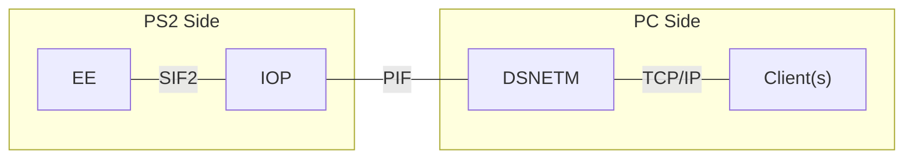
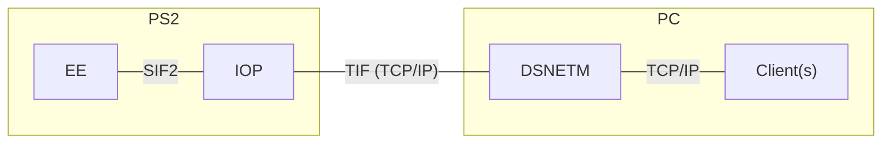

Retail DeBugging startup card README file	- 2017/06/10
------------------------------------------------------------

What is the Retail DeBugging (RDB) startup card?
It is a clone of the Sony TDB startup card, which gives certain TEST/debugstation consoles (which support Magicgate) some DECI2 debugging functionality.

Traditionally, development and debugging of games and software was entirely done on PlayStation 2 TOOL consoles,
which are basically each a PlayStation 2 console and PC in one unit.
Both entities are linked together through something known as the "PIF":

Retail consoles are essentially similar to debugstation consoles,
except that their CD/DVD drive **MECHA**nics **CON**troller (MECHACON) chips don't accept master discs, but support MagicGate and DVD video discs fully.

Since these consoles lack the TOOL unit's PIF, Sony substitutes it with a virtual interface that is known as the "TIF", which sends data over the network:

Unfortunately, like the debugstation, the retail set has a boot ROM that contains an `IOPBTCONF` [^IOPBTCONF] file that doesn't list the DECI2 modules.
 
[^IOPBTCONF]: a list of modules to be loaded during every IOP reboot

As a result, it is not possible to reboot the IOP normally without cutting off DECI2 support.

On a real TOOL unit, the IOP is usually not reboot during development, so being unable to reboot the IOP during development is not much of a loss.

What is DSNET?
--------------

DSNET is a collection of development tools that run on the development PC. Some of the probably more important tools would be:
1. **DSNETM**:	DSNET Manager (all tools connect to this, which will connect to the PlayStation 2)
2. **DSEDB**:	EE debugger
3. **DSIDB**:	IOP debugger
4. **DSICONS**:	IOP console monitor
5. **DSECONS**:	EE console monitor

Variations of RDB
-----------------

Currently, there are two variants of RDB:
RDB	- the "vanilla" version of RDB. This works similarly to the TDB Startup Card.
RDB-UIF	- a variation of RDB that has the network protocol stack and SMAP driver integrated into the host interface driver.
		The host interface driver was renamed to become the "Universal InterFace" (UIF).
		While it is still dependent on the customizations to the IOP DECI2 manager, it allows DSIDB to be used because the networking functionality can run from the interrupt context.

Limitations, which the TDB startup card also has:
-------------------------------------------------

1. The IOP cannot be rebooted at all, so functions like SifIopReboot() and SifIopReset() must not be used.
2. LoadExecPS2() cannot be used, as it causes an IOP reset.
3. The Ethernet port cannot be used, as it is used by RDB itself.
	It is, however, still possible to use the HDD unit. DEV9.IRX will be automatically loaded by RDB.
4. *IOP-side debugging cannot be performed due to limitations in RDB's design. dsidb can still be run, but the IOP will cease to respond if a BREAK is issued.
5. As DEV9.IRX is loaded, an expansion bay unit cannot be reset by pressing the RESET button once. If the button is held down, the console will be switched off.
6. When the IOP is heavily loaded, dsedb may not respond well.
7. *There is no support for IKTTY (i.e. Kprintf).

*Does not apply to RDB-UIF.

Limitations, which are unique to RDB:
-------------------------------------------------------
1. If the stock EE kernel is used, thread information cannot be retrieved because these kernels don't support the "EE thread extension".
	See "Other features" to learn about replacing the EE kernel.
2. If the stock EE kernel is used, the DECI2 reset command cannot be used because of missing functionality. To reset RDB, perform a hard reset.

Differences in functionality from the TDB startup card:
-------------------------------------------------------
1. IOP-side TTY output works. Homebrew software redirect EE-side printf() output to the IOP, so printf() from the EE will be sent to dsicons.

Other features:
---------------
1. EE kernel replacement:
	By default, RDB uses your retail console's stock EE kernel. However, this kernel lacks the "EE thread extension",
		which renders it unable to show information related to threading (e.g. thread and semaphore status).
	By placing a replacment EE kernel (e.g. the one from the TDB startup card or a TOOL) as KERNEL.bin in the same location as RDB,
		RDB will use the substitute EE kernel instead.
2. IOP kernel module replacement:
	By default, RDB uses your retail console's stock IOP kernel modules.
	By placing a replacment IOP kernel module image as IOPRP.img in the same location as RDB, RDB will use the substitute IOP kernel modules instead.
3. Network configuration:
	RDB retrieves your network configuration from mc:/SYS-CONF/IPCONFIG.DAT, which has this format:
		IP address
		Subnet mask
		Gateway
		<optional: link speed and duplex mode: 10HDX, 10FDX, 100HDX,100FDX or AUTO. AUTO is the default if nothing is specified>

Supported boot device:
----------------------
*Memory Card only

Note: while RDB will still boot from unsupported devices (i.e. USB disks), it will not be able to load replacement EE/IOP kernels.

How to use RDB:
---------------
1. Prepare your network configuration file (IPCONFIG.DAT).
2. Copy RDB to the desired place on your memory card.
3. Download the DSNET tools, including DSNETM.
4. Connect your PS2 to your network/to your PC.
5. Start DSNETM, specifying your PS2's IP address.
6. Run other DECI2 tools. If DSEDB/DSIDB are run, remember to specify the "no reset" option (-nr).

Credits:
--------
SilverBull, for the DECI2 modules, DSNET programs and for sharing his knowledge.

